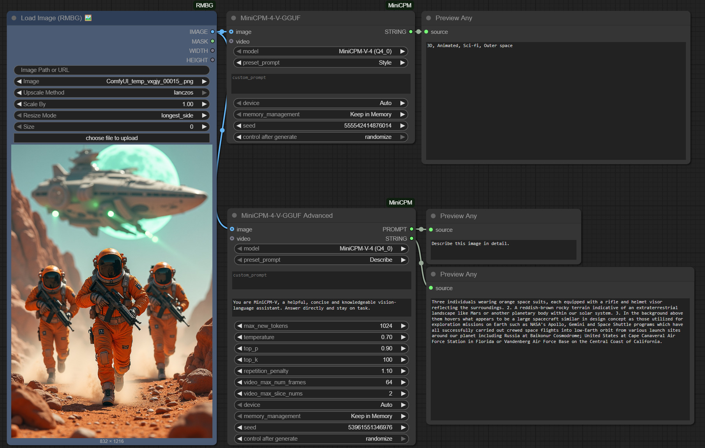
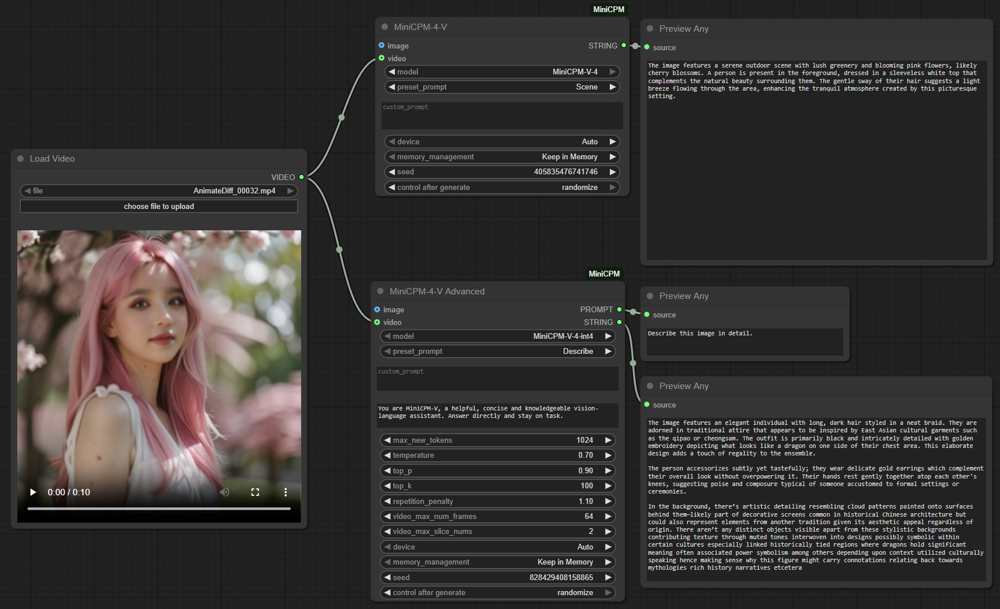

# ComfyUI-MiniCPM

一个用于 MiniCPM 视觉语言模型的 ComfyUI 自定义节点，支持 v4、v4.5 及 v4 GGUF 格式，实现高质量图像描述与视觉分析。

**🎉 现在支持 MiniCPM-V-4.5！最新的模型，拥有增强的能力。**

---
## 新闻与更新

- **2025/08/27**：ComfyUI-MiniCPM 更新至 **v1.1.0**（[更新日志](https://github.com/1038lab/ComfyUI-MiniMPC/blob/main/update.md#v110-2025-08-27)）
[](example_workflows/MiniCPM_v4VSv45.json)
- 新增对 **MiniCPM-V-4.5** 模型（Transformers）的支持


## 功能特点
- MiniCPM-V-4 GGUF
[](example_workflows/MiniCPM-V-4-GGUF.json)
- MiniCPM-V-4 Batch Images
[](example_workflows/MiniCPM-V-4_batchImages.json)
- MiniCPM-V-4 video
[](example_workflows/MiniCPM-V-4_video.json)

- 支持 **MiniCPM-V-4.5 (Transformers)** 和 **MiniCPM-V-4.0 (GGUF)** 模型
- **最新 MiniCPM-V-4.5** 通过 Transformers 提供增强的能力
- 多种描述类型，适用于不同使用场景（描述、标题、分析等）
- 内存管理选项，平衡显存使用和速度
- 首次使用时自动下载模型文件，便于设置
- 可自定义参数：最大令牌数、温度、top-p/k 采样、重复惩罚
- 高级节点，支持全参数控制
- 向后兼容的旧版节点
- V4.0 模型的全面 GGUF 量化选项

---

## 安装

将仓库克隆到您的 ComfyUI 自定义节点文件夹：

```bash
cd ComfyUI/custom_nodes
git clone https://github.com/1038lab/comfyui-minicpm.git
```
安装所需依赖：

```bash
cd ComfyUI/custom_nodes/comfyui-minicpm
ComfyUI\python_embeded\python pip install -r requirements.txt
ComfyUI\python_embeded\python llama_cpp_install.py
```

> [!note]
> `llama-cpp-python` CUDA Installation for ComfyUI Portable
> - [llama_cpp_install_zh.md](llama_cpp_install/llama_cpp_install_zh.md)
---

## 支持的模型

### Transformers 模型
| 模型                | 描述                                    |
| -------------------- | ---------------------------------------------- |
| **MiniCPM-V-4.5**        | 🌟 **最新 V4.5 版本，增强能力** |
| **MiniCPM-V-4.5-int4**   | 🌟 **V4.5 4位量化版本，内存占用更小** |
| MiniCPM-V-4          | V4.0 全精度版本，质量更高   |
| MiniCPM-V-4-int4     | V4.0 4位量化版本，内存占用更小 |

https://huggingface.co/openbmb/MiniCPM-V-4_5  
https://huggingface.co/openbmb/MiniCPM-V-4_5-int4  
https://huggingface.co/openbmb/MiniCPM-V-4
https://huggingface.co/openbmb/MiniCPM-V-4-int4

### GGUF 模型

> **注意**：由于 llama-cpp-python 兼容性问题，MiniCPM-V-4.5 GGUF 模型暂时不可用。请使用 MiniCPM-V-4.5 Transformers 模型或 MiniCPM-V-4.0 GGUF 模型。

#### MiniCPM-V-4.0（完全支持）
| 模型                | 大小      | 描述                           |
| -------------------- | --------- | ------------------------------------- |
| **MiniCPM-V-4 (Q4_K_M)** | ~2.19GB   | **推荐的质量/大小平衡** |
| MiniCPM-V-4 (Q4_0)      | ~2.08GB   | 标准 4-bit 量化          |
| MiniCPM-V-4 (Q4_1)      | ~2.29GB   | 4-bit 量化改进版          |
| MiniCPM-V-4 (Q4_K_S)    | ~2.09GB   | 4-bit K-quants 小                 |
| MiniCPM-V-4 (Q5_0)      | ~2.51GB   | 5-bit 量化                   |
| MiniCPM-V-4 (Q5_1)      | ~2.72GB   | 5-bit 量化改进          |
| MiniCPM-V-4 (Q5_K_M)    | ~2.56GB   | 5-bit K-quants 中等                |
| MiniCPM-V-4 (Q5_K_S)    | ~2.51GB   | 5-bit K-quants 小                 |
| MiniCPM-V-4 (Q6_K)      | ~2.96GB   | 非常高的质量                    |
| MiniCPM-V-4 (Q8_0)      | ~3.83GB   | 最高质量量化            |

https://huggingface.co/openbmb/MiniCPM-V-4-gguf

> 模型将在首次运行时自动下载。
> 也支持手动下载并放置到 `models/prompt_generator`（transformers）或 `models/LLM/GGUF`（GGUF）目录。

---

## 可用节点

### 1. MiniCPM-4-V
- 基础 transformers 节点，包含基本参数
- 支持图像和视频输入
- 内存管理选项
- 预设提示类型

### 2. MiniCPM-4-V Advanced
- 功能完整的 transformers 节点
- 所有参数可自定义
- 系统提示词支持
- 高级视频处理选项

### 3. MiniCPM-4-V-GGUF
- 基于 GGUF 的节点，包含基本参数
- 针对性能优化

### 4. MiniCPM-4-V-GGUF Advanced
- 功能完整的 GGUF 节点
- 所有参数可自定义

---

## 使用方法

1. 在 ComfyUI 的 `🧪AILab` 类别中添加 **MiniCPM** 节点。
2. 将图像或视频输入节点连接到 MiniCPM 节点。
3. 选择模型变体（transformers 默认为 MiniCPM-V-4-int4）。
4. 选择描述类型并根据需要调整参数。
5. 执行您的工作流以生成描述或分析。

---

## 配置默认值

```json
{
  "context_window": 4096,
  "gpu_layers": -1,
  "cpu_threads": 4,
  "default_max_tokens": 1024,
  "default_temperature": 0.7,
  "default_top_p": 0.9,
  "default_top_k": 100,
  "default_repetition_penalty": 1.10,
  "default_system_prompt": "You are MiniCPM-V, a helpful, concise and knowledgeable vision-language assistant. Answer directly and stay on task."
}
```

---

## 描述类型

* **Describe:** 详细描述这张图片。
* **Caption:** 为这张图片写一个简洁的标题。
* **Analyze:** 分析这张图片中的主要元素和场景。
* **Identify:** 您在这张图片中看到什么物体和主体？
* **Explain:** 解释这张图片中正在发生什么。
* **List:** 列出这张图片中可见的主要物体。
* **Scene:** 描述这张图片的场景和背景。
* **Details:** 这张图片中的关键细节是什么？
* **Summarize:** 用1-2句话总结这张图片的关键内容。
* **Emotion:** 描述这张图片传达的情感或氛围。
* **Style:** 描述这张图片的艺术或视觉风格。
* **Location:** 这张图片可能在哪里拍摄？分析背景或位置。
* **Question:** 基于这张图片可以提出什么问题？
* **Creative:** 将这张图片描述为短篇小说的开头。

---

## 内存管理选项

* **Keep in Memory:** 模型保持加载状态，后续运行更快
* **Clear After Run:** 每次运行后卸载模型以节省内存
* **Global Cache:** 模型全局缓存并在节点间共享

---

## 使用技巧

* 🌟 **优先尝试 MiniCPM-V-4.5 Transformers** - 相比 V4.0 拥有增强的能力
* 获得**最佳平衡**：使用 MiniCPM-V-4 (Q4_K_M) GGUF 模型
* 获得**最高质量**：使用 MiniCPM-V-4.5 Transformers
* 面向**低显存**：使用 MiniCPM-V-4.5-int4 或 MiniCPM-V-4 (Q4_0) GGUF
* 调整温度（0.6-0.8）以平衡创造性和连贯性。
* 使用 top-p（0.9）和 top-k（80）采样以获得自然的输出多样性。
* 在性能较低的 GPU 上降低最大令牌数或精度（bf16/fp16）以获得更快的生成速度。
* 内存模式有助于优化显存使用：默认、平衡、最大节省。
* Transformers 模型提供更好的质量但使用更多内存。
* GGUF 模型更节省内存但质量可能稍低。

---

## 故障排除

### 常见问题

1. **模型下载失败**
   - 检查网络连接
   - 确保有足够的磁盘空间
   - 尝试手动下载模型

2. **内存不足错误**
   - 使用较小的模型（如 MiniCPM-V-4-int4）
   - 启用"Clear After Run"内存管理
   - 减少最大令牌数

3. **CUDA 错误**
   - 确保安装了正确版本的 PyTorch
   - 检查 CUDA 驱动是否最新
   - 尝试使用 CPU 模式

### 性能优化

- 使用 GPU 模式以获得最佳性能
- 对于批量处理，使用"Global Cache"内存管理
- 调整视频帧数以平衡质量和速度

## 许可证

GPL-3.0 许可证

---

## 致谢

感谢所有为这个项目做出贡献的开发者和用户！

---

**注意:** 如果您需要英文版文档，请查看 [README.md](README.md)。 